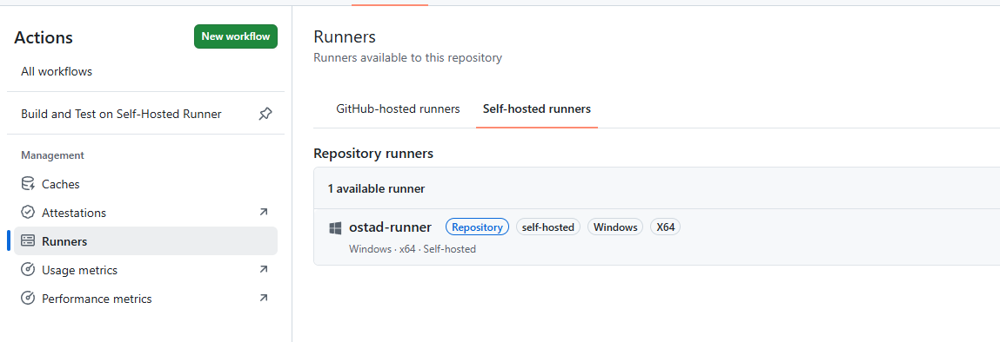
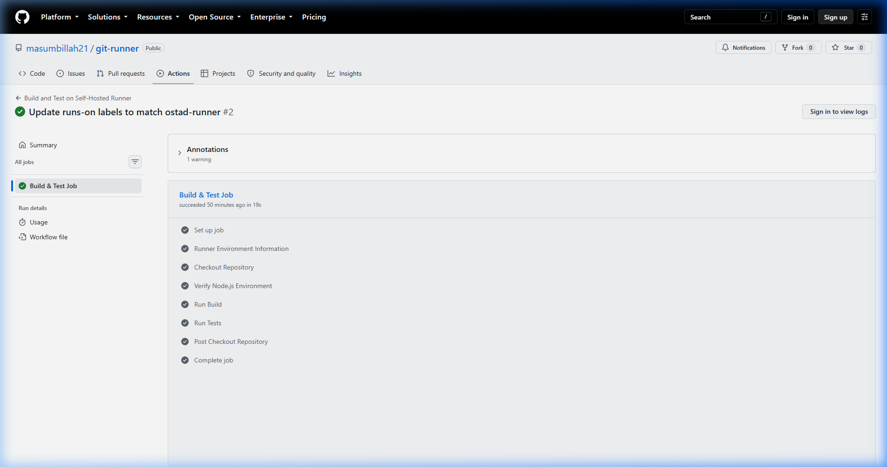

# GitHub Self-Hosted Runner Assignment

This repository demonstrates the setup and execution of a GitHub Actions Self-Hosted Runner named **`ostad-runner`** running a basic build and test workflow.

---

## 📋 Assignment Requirements & Compliance

| Requirement | Implementation Details | Status |
| :--- | :--- | :---: |
| **Runner Name** | `ostad-runner` | ✅ Met |
| **Workflow** | Basic build and test execution (`.github/workflows/build-test.yml`) | ✅ Met |
| **Runner Execution** | Executed on the self-hosted Windows machine using `ostad-runner` | ✅ Met |
| **Screenshot Proof** | Successful workflow/job execution screenshot included | ✅ Met |

---

## 🛠️ Workflow Details

The workflow is defined at [`.github/workflows/build-test.yml`](.github/workflows/build-test.yml):

- **Target Runner**: `runs-on: [self-hosted, Windows, X64]` (Runner: `ostad-runner`)
- **Successful Job Run**: [Build & Test Job #2](https://github.com/masumbillah21/git-runner/actions/runs/35828531684/job/107075551740)
- **Triggers**: `push`, `pull_request`, `workflow_dispatch`
- **Steps**:
  1. Environment diagnostics & runner details
  2. Repository checkout (`actions/checkout@v4`)
  3. Environment check (`node -v`, `npm -v`)
  4. Project build (`npm run build`)
  5. Test suite execution (`npm test`)

---

## 📸 Screenshots & Proof of Execution

### 1. Configured Self-Hosted Runner (`ostad-runner`)
The runner was registered and connected as `ostad-runner`:



### 2. Successful Workflow & Job Execution
The build & test job executed successfully on `ostad-runner`:



---

## 🚀 How Runner Was Configured

1. Downloaded GitHub Actions Runner package for Windows x64.
2. Registered runner with repository:
   ```powershell
   ./config.cmd --url <REPO_URL> --token <REGISTRATION_TOKEN> --name ostad-runner --labels ostad-runner --unattended
   ```
3. Started runner listener:
   ```powershell
   ./run.cmd
   ```
4. Pushed workflow to trigger automated execution on `ostad-runner`.
